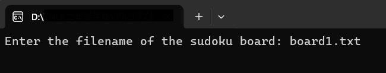
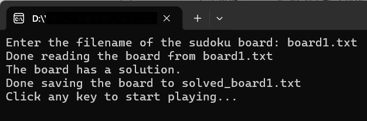
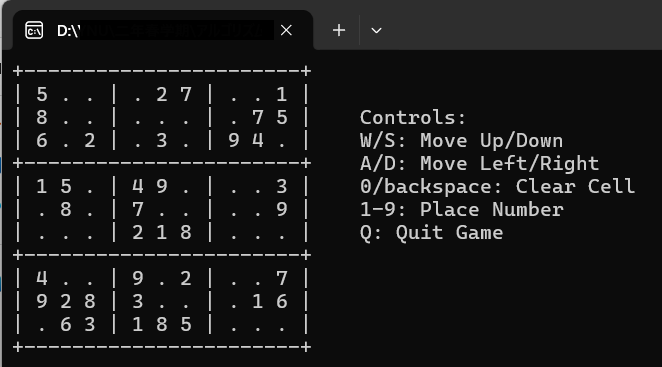
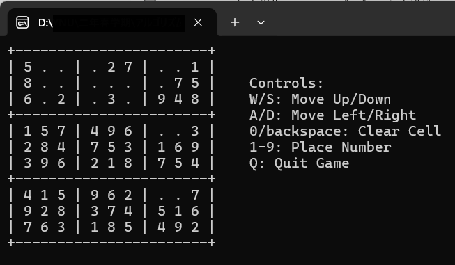
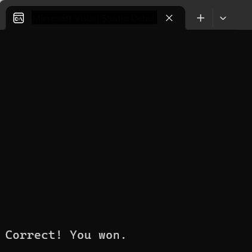
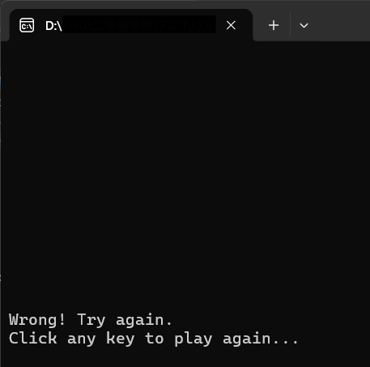
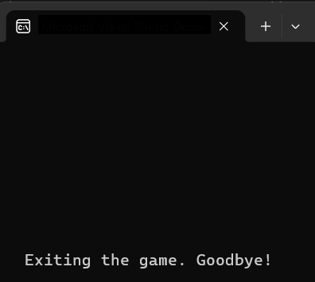
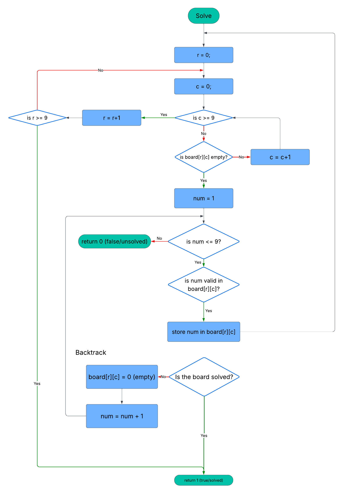

# Sudoku Game & Solver 
An interactive terminal-based Sudoku game with a built-in **backtracking** solver, implemented in C. 

# Features 
- Solves Sudoku boards using backtracking
- Fully playable Sudoku game in the terminal
- Keyboard controls (W/A/S/D movement)
- Prevents modifying original cells
- Validates player solution
- Saves solved board to file
- Reads board from `.txt` file

# Game Demo 
1. Enter a Sudoku file  

2. The program solves it internally  

3. You play manually  


4. Your solution is checked against the correct one  


5. You can quit anytime by pressing Q  


# Example Input 
The text file must be of the following format (example from board1.txt)
```
5,0,0,0,2,7,0,0,1
8,0,0,0,0,0,0,7,5
6,0,2,0,3,0,9,4,0
1,5,0,4,9,0,0,0,3
0,8,0,7,0,0,0,0,9
0,0,0,2,1,8,0,0,0
4,0,0,9,0,2,0,0,7
9,2,8,3,0,0,0,1,6
0,6,3,1,8,5,0,0,0
```
**zero** refers to empty cells. 
# How to Run
```
gcc sudoku.c sudoku-game.c -o sudoku
./sudoku
```
Then enter the name of the text file containing your board; for instance, `board1.txt`.

# How It Works 
## 1. Reading the Board
- `readBoardfromFile()` loads the board into a 2D array.
## 2. Solving Algorithm
- Uses recursive **backtracking**
- Tries numbers (1 - 9)
- Validates using: 
  - Row
  - Colum
  - 3x3 grid
### Flowchart

## 3. Game 
You play using: 
|**Key**|**Action**|
|---|---|
|W / S|Move up / down|
|A / D|Move left / right|
|1-9|Place number|
|0 / Backspace|Clear cell|
|Q|Quit|

The controls are implemented in the `play()` function.
## 4. Validation
- When the board is full: 
  - It gets compared with the solved board
  - If correct --> you win
  - If wrong --> retry

# Project Structure
```
Sudoku-Game-and-Solver/
│── sudoku.c          # Core logic (solver + game)
│── sudoku.h          # Function declarations
│── sudoku-game.c     # Main program
│── board1.txt        # Example input
│── board2.txt        # Example input
│── img/              # Flowchart + demo images
```
# Key Functions 
- `solve()` --> backtracking solver
- `isValid()` --> checks constraints
- `play()` --> updates board safely
- `compare()` --> checks correctness

# References 
1. The following [site](https://sudoku.com/easy/) was used as a reference for the Sudoku boards used to test this program
2. The following [site](https://lucid.app/) was used to create a flowchart for the process
3. The following [video for the **Back To Back SWE**](https://youtu.be/JzONv5kaPJM?si=abBCNaauUhB2uUjM) channel was used to understand the basic flow of backtracking in Sudoku 
